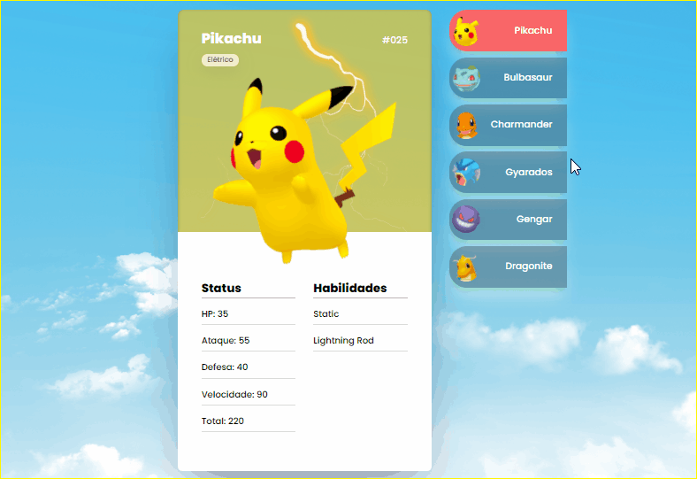
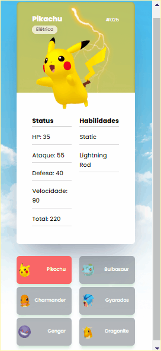

<h1 align="center">
  
</h1>

Este projeto foi feito no evento MapaDev Week do @devemdobro. O objetivo do evento era criarmos nosso primeiro projeto web que seria uma Pokédex. O meu projeto não ficou igual ao do evento, pois queria deixar com minha personalidade e aprender coisas novas.

 <h3>👀 Visualize o projeto aqui</h3>

 [Link Projeto](https://revertemayene.github.io/projeto-pokedex/)

 

---
## 🖥️ Prévia do projeto para Web

<h1 align="center">
 
  
 
</h1>

## 📱 Prévia do projeto para Mobile

<h1 align="center">
 
  
 
</h1>

## 🚀 Tecnologias utilizadas

- ✔️ HTML5

- ✔️ CSS3

- ✔️ JavaScript

Feito com o 💛 por Mayene Reverte [Meu linkedIn](https://www.linkedin.com/in/mayenereverte/)

